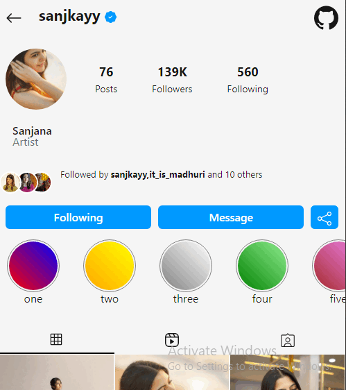

## **Instaprofile**

Its just an **Instagram Profile** in desktop and mobile versions

**Built with**
 * HTML
 * CSS
 * Bootstrap
 * Jquery
 * Swiperjs

It is the replication of original instagram profile
when you see it on your desktop you will have the images popped on **onclick** when you shrink the browser window or see it in mobile you will get a different design to see as we see our profile in instagram.By **doubleclicking** you can see the heart animation.

## **Desktop version**

## **Mobile version**

> It is also enabled auto dark and light theme according to your devices

*__you can see the demo here__*
https://dineshmister.github.io/Instaprofile/
